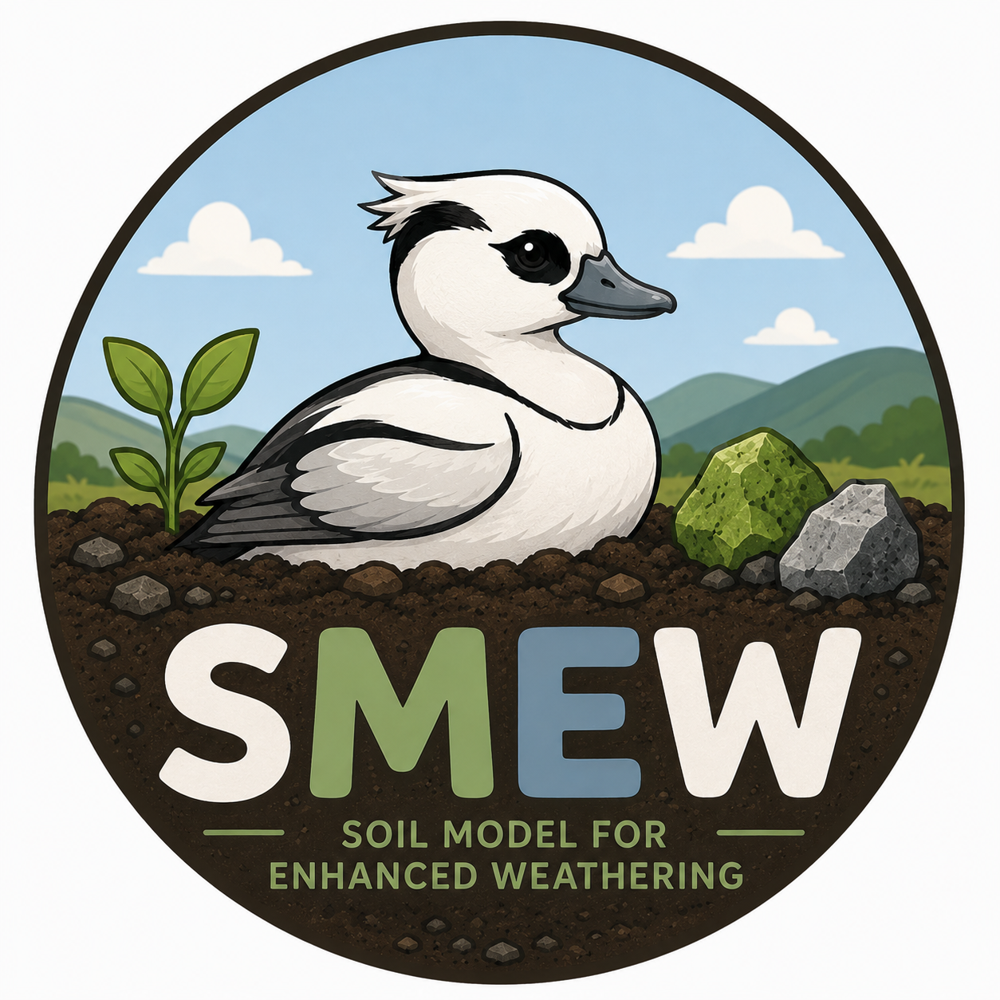

<p align="center">
  
</p>

# Soil Model for Enhanced Weathering (SMEW)

This folder contains all material related to the Soil Model for Enhanced Weathering (SMEW) published in Bertagni et al., 2025, JAMES
The material includes the numerical codes for the model, the experimental data used for the analyses, and the Jupyter notebooks for the model-experiment comparison.

Article: [https://doi.org/10.1029/2024MS004224](https://doi.org/10.1029/2024MS004224)  
Zenodo repository: [https://doi.org/10.5281/zenodo.14356660](https://doi.org/10.5281/zenodo.14356660)  
GitHub repository: [https://github.com/MatteoBertagni/SMEW](https://github.com/MatteoBertagni/SMEW)  
PyPi package: [https://pypi.org/project/smew](https://pypi.org/project/smew)

Install with:

```bash
pip install smew
```

Release wheels contain the compiled Cython equations and bundled cminpack solver;
installing a matching wheel requires no C compiler. Wheels are built for CPython
3.11–3.14 on Linux x86-64 and ARM64 (glibc 2.28+), macOS Apple Silicon
(macOS 11+), and Windows x86-64. Intel macOS wheels support CPython 3.11–3.13
and use Numba 0.62, the last series with upstream Intel macOS binaries
([Numba release notes](https://numba.readthedocs.io/en/stable/release/0.62.0-notes.html)).
Dependencies may impose newer OS requirements.
Alpine/musl, Windows ARM64, and free-threaded Python are not currently wheel targets.
If no matching wheel exists, pip attempts to build the source distribution and
requires a C compiler. To require a SMEW wheel instead, use
`python -m pip install --only-binary=smew smew`.

Numerical calculations use ordinary Numba `@njit` decorators, including
vegetation, temperature, rainfall, moisture, organic carbon, soil pores,
weathering, initialization, and both biogeochemistry models. Compilation happens
on the first call. `ET0` and plotting functions remain Python.

Run the same code as Python by setting Numba's standard switch **before importing
SMEW** (restart an existing notebook kernel):

```bash
python simulation.py                       # Numba enabled
NUMBA_DISABLE_JIT=1 python simulation.py    # Python, with SciPy solvers
```

Or set it at the beginning of a fresh Python session:

```python
import os
os.environ["NUMBA_DISABLE_JIT"] = "1"
import smew

v = smew.veg(v_in, T_v, k_v, t0_v, temp_soil, dt)
result = smew.biogeochem_balance(**inputs)
```

Numba-enabled nonlinear solves use the bundled cminpack solver and Cython 
equations; disabled JIT uses SciPy's `fsolve` and the Python equations. 
The native solver is loaded only when a compiled solve is needed, 
so the other numerical calculations can compile without it.
Small Python entry-point wrappers handle array conversion, solver
warnings, and result dictionaries. The two-application model returns named
numerical results.

Stochastic rainfall uses NumPy's exponential sampler. Numba maintains its own
random state, so Python and compiled rainfall runs need not produce identical
samples. Numba's disk cache is disabled because the solver uses process-local
function pointers.

### Optional CPU-tuned source installation

To tune the compiled extensions for your CPU, build from source with a C compiler.
On Linux/macOS with GCC or Clang:

```bash
SMEW_CPU_TARGET=native python -m pip install --no-binary=smew --no-cache-dir smew
```

On Windows with MSVC and an AVX2-capable CPU (PowerShell):

```powershell
$env:SMEW_CPU_TARGET = "avx2"
python -m pip install --no-binary=smew --no-cache-dir smew
Remove-Item Env:SMEW_CPU_TARGET
```

Add `--force-reinstall --no-deps` to rebuild an already installed version.

# Folders

- `smew`: contains the python codes for the SMEW numerical model
- `Exp_data`: contains the experimental data obtained from the various publications through a web plot digitizer (https://apps.automeris.io/wpd/)
- `pyeto`: contains the Python codes to estimate the potential evapotranspiration (Mark Richards, https://pyeto.readthedocs.io/en/latest/index.html)


# Jupyter notebooks

- `Example`: provides an example of simulation for an EW application 
- `Vials_Dietzen`: model-experiment comparisons with the experiments by Dietzen et al. (2018)
- `Bottles_tePas`: model-experiment comparisons with the experiments by tePas et al. (2023)
- `Mesocosm_Amann`: model-experiment comparisons with the experiments by Amann et al. (2020)
- `Mesocosm_Kelland`: model-experiment comparisons with the experiments by Kelland et al. (2020)


# Instructions

1. Download or pull the whole repository into a selected working directory.
2. Run the Juptyer notebook 'Example' to verify that the model components (pyEW) are correctly used within the notebooks.
3. Change the parameters in the file 'Example' to run specific simulations for different scenarios.
4. For the Jupyter notebooks of the model-experiment comparison, define the selected base directory in the first cell of each notebook.

## Development and model testing

Requires Python 3.11+. Once the repository cloned, install with `pip install -e '.[dev]'`,
then run `make test` for full-year time-series comparisons and physical-range checks.
Use `make example` to open the marimo example with plots generated on demand.
See [tests/README.md](tests/README.md) for setup and reference updates.

`make build` (or `make build-native`) creates a source archive and wheel with
the private Cython equations and cminpack solver extensions.
`make install-native` rebuilds them in the active editable installation after
equation changes. Use
`make install-python` for a source installation without a C compiler, or
`make build-python` to package that variant. `make clean` removes generated
build directories and distributions. The Python source remains
available as `smew.equations`; restart the Python process after a native
rebuild.

`SMEW_BUILD_NATIVE=0` disables the C extensions; `SMEW_CPU_TARGET` independently
controls their CPU tuning. For a tuned editable build, run
`SMEW_CPU_TARGET=native make install-native`. Build dependencies, including
Cython, are installed by pip in an isolated build environment.

### Release packaging

The **Build and publish distributions** GitHub Actions workflow builds one
source archive and uses cibuildwheel to build all platform wheels from that
archive. Every wheel is installed and tested outside the source tree, including
Numba-to-cminpack calls and short Python/compiled simulation comparisons. Native
extensions and license notices must be present; missing extensions fail the job.
Source archives include the Cython and cminpack sources and the wheel test suite,
but exclude local binaries, Numba caches, and large regression baseline files.

Pull requests and manual workflow runs produce downloadable artifacts without
publishing. Publishing a GitHub release triggers the same builds, and uploads the
source archive and wheels to PyPI only after every platform passes. The existing
PyPI trusted publisher must authorize this repository and `python-publish.yml`.
Set a new version in `pyproject.toml` before releasing; PyPI versions cannot be
overwritten. The separate Tests workflow retains the full model regressions.

## License

This project is licensed under the GNU Affero General Public License v3.0 (AGPL-3.0).

See the `license` file for details.

SMEW includes cminpack's hybrid solver source under the terms in
[third_party/cminpack/CopyrightMINPACK.txt](third_party/cminpack/CopyrightMINPACK.txt).
This product includes software developed by the University of Chicago, as
Operator of Argonne National Laboratory.

# Contact

You can contact me at @MatteoBertagni ([matteo.bertagni@polito.it](mailto:matteo.bertagni@polito.it)) for more information about the research.
